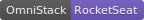

# Omnistack Week

<!-- LOGO -->

<!-- SHILD -->

<!-- TABLE OF CONTENTS -->

## Tabela de Conteúdo

- [Tabela de Conteudo](#tabela-de-Conteudo)
- [Sobre o Projeto](#sobre-o-projeto)
  - [Backend](#backend)
  - [Frontend](#frontend)
  - [Mobile](#mobile)
- [Instalacoes](#enstalacoes)
  - [Backend](#backend)
- [Contato](#contato)

<!-- ABOUT -->

## Sobre o Projeto

Este projeto foi desenvolvimento durante a Semana Omnistack 11, idealizada pela <a href="https://rocketseat.com.br">RocketSeat</a>. Criando uma aplicação completa contendo Backend, Frontend e App Mobile.

### Backend

O **Backen** foi construido em **NodeJS** utilizando os seguintes frameworks:

- Express
- TypeORM
- Cors
- Helmet

### Frontend

Para o desenvolvimento do **Frontend** utilizou-se **ReactJS** e os seguintes framkeworks:

- Axios

### Mobile

Por fim, o desenvolvimento do **App Mobile** utilizou-se **React Native** e os seguintes frameworks:

- Axios

---

## Instalacoes
